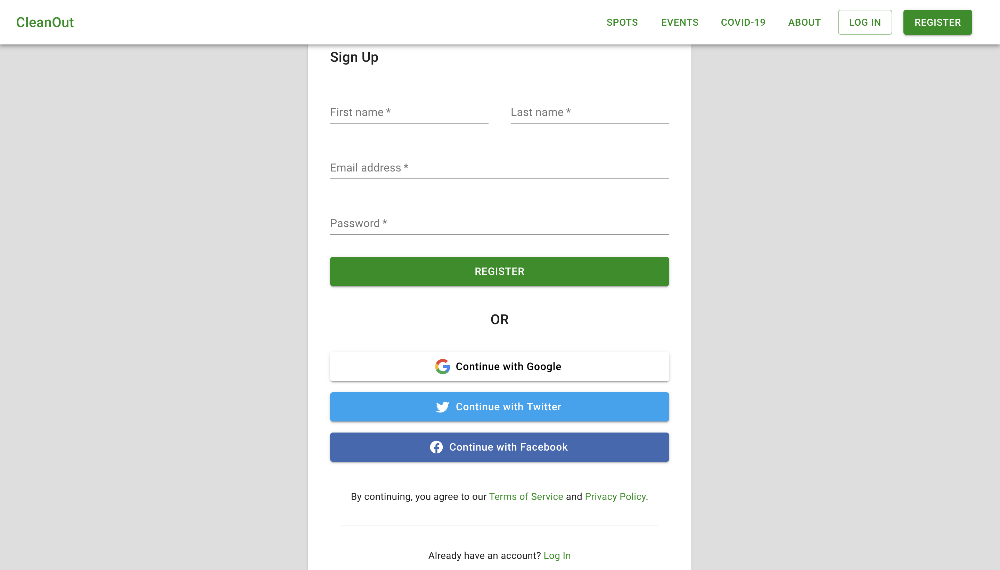
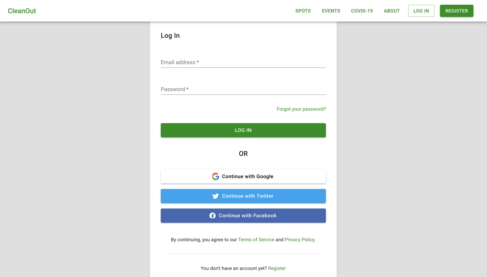

# Team-253-Group-A-Frontend

## About the team

We are a team of 4 members :  
[Khalil Hammami](https://github.com/khammami)  

[Ojoechem Chinonso](https://github.com/ChinonsoIg)  
 

[Sara EL-ATEIF](https://github.com/elateifsara)  

[Sofia Bourhim](https://github.com/SofiaBee-W)  
 

## About our project "CleanOut"

CleanOut is an app built to help communities clean their neighborhood by letting users report trash by uploading (geotagged) image locations.  
Each report has a status (trash cleaned or not). Users can create an event to gather volunteers to help during the cleaning process. For COVID-19, AI will check if the uploaded images contain any COVID-19 trash like masks that needs precaution measures to clean. Or the user can choose to report to local authorities instead.

Please check out the application following this [link](https://awesome-jang-7f1fc2.netlify.app/).

## Features available

### Register

To register or sign up please click on the `REGISTER` button on the upper right and either :
- fill in the required information
**Or**
- use on of the social media providers like your `Google` or `Facebook` account 

### Log In

If you have already created an account (Register), then please click on the `LOG IN` button on the upper right to log in and either:
- fill in the required information
**Or**
- use on of the social media providers like your `Google` or `Facebook` account

### Add a trash report

If you found trash in your neighborhood or on your walk then please report by clicking on the `New report` button on the left by the foot of the app. Please fill in the title, description and location of the trash site.

## Privacy Policy

Please remember to read the [Privacy Policy](https://awesome-jang-7f1fc2.netlify.app/privacy-policy) instructions.

## Terms of Service

Please remember to read the [Terms of Service](https://awesome-jang-7f1fc2.netlify.app/terms-of-services) instructions.

## License
